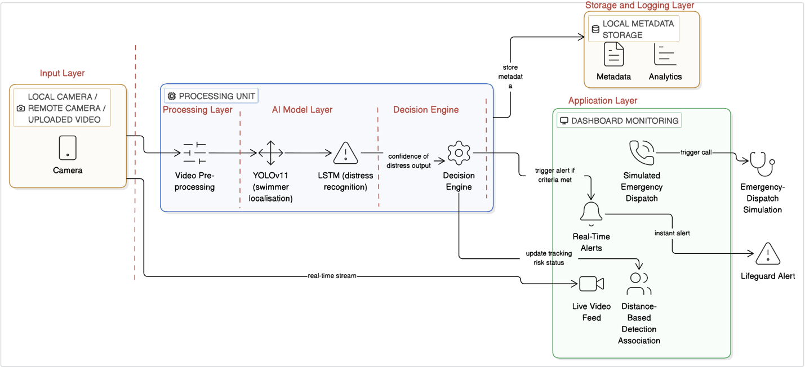
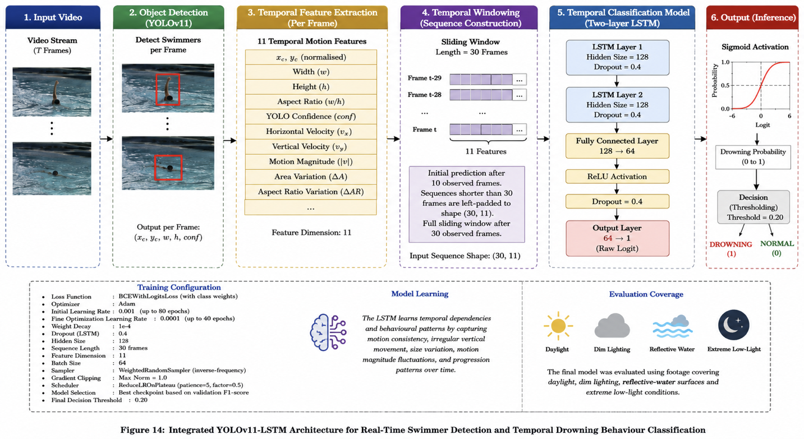
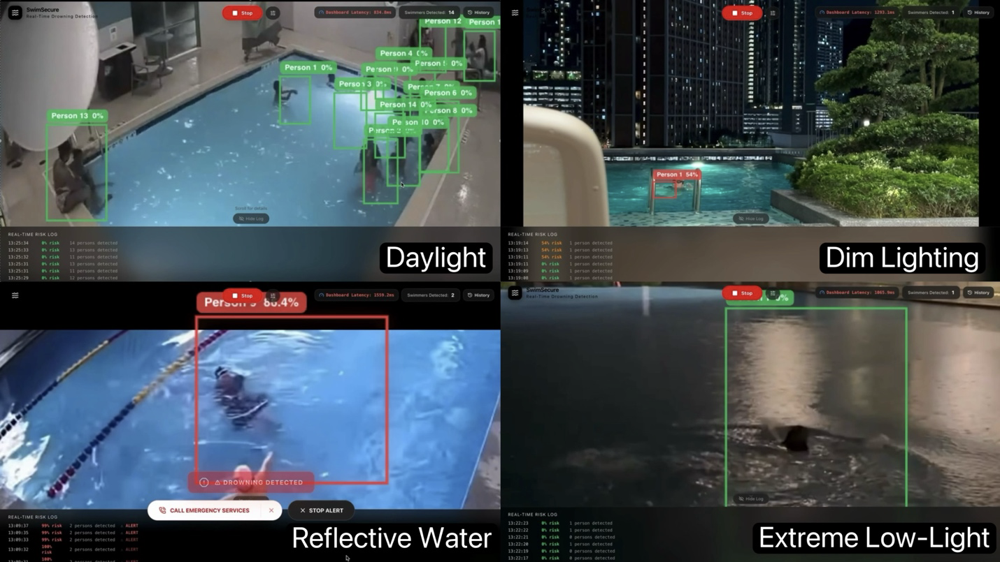
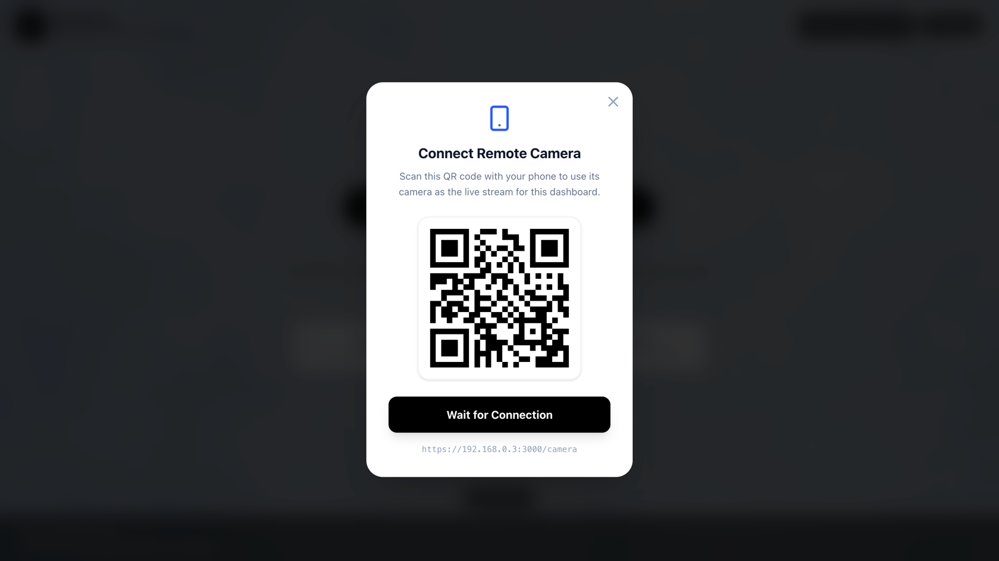
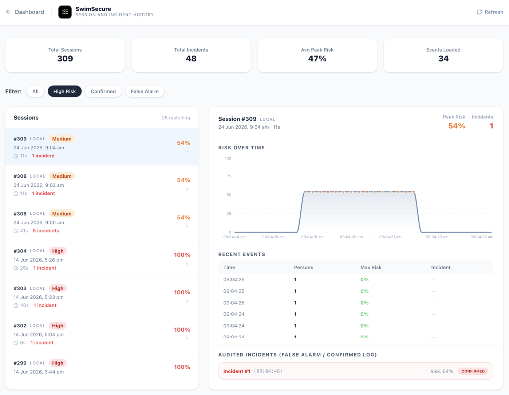
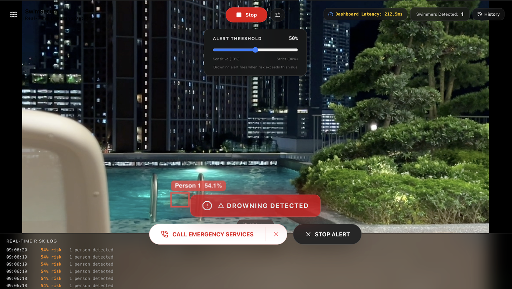

# SwimSecure AI — Real-Time Drowning Detection System

A real-time AI-powered drowning detection system that processes video streams, detects swimmers using YOLOv11, classifies temporal behaviour using an LSTM, and delivers risk alerts through a web dashboard.

---

## Live Demo

**Frontend dashboard:** [Deployed on Vercel](https://swim-secure.vercel.app)

> The production inference backend is not currently hosted. Full end-to-end functionality — including live YOLOv11 detection and LSTM drowning classification — can be run locally using the included backend.

---

## Key Features

- **Real-time swimmer detection** using a custom-trained YOLOv11 model
- **Drowning risk classification** using a two-layer LSTM on temporal bounding box sequences
- **Live video streaming** from browser webcam or remote camera via WebSockets
- **Risk scoring per swimmer** with configurable alert thresholds
- **Incident logging** — every session, frame-level event, and alert persisted to PostgreSQL
- **Session history dashboard** with per-session event replay and statistics
- **Operator feedback loop** — confirm or dismiss alerts (confirmed / false alarm)
- **QR code remote streaming** — share camera feed from a mobile device on the same network
- **Emergency dispatch modal** with location selector

---

## Tech Stack

| Layer | Technology |
|---|---|
| Object Detection | YOLOv11 (Ultralytics), PyTorch |
| Temporal Classification | LSTM (PyTorch), custom 11-feature window |
| Backend API | FastAPI, Python 3.12 |
| Real-time Transport | WebSockets |
| Database | PostgreSQL, SQLAlchemy (async), asyncpg |
| Frontend | Next.js 16, React 19, TypeScript |
| UI Components | Tailwind CSS v4, Recharts, Lucide React, React Webcam |
| Model Serving | Uvicorn (ASGI), `asyncio.to_thread` for inference |

---

## System Architecture



---

## AI/ML Pipeline



---

## Model Performance

### YOLOv11 Swimmer Detection

| Metric | Score |
|---|---|
| Precision | 0.887 |
| Recall | 0.889 |
| mAP@50 | 0.941 |

### LSTM Drowning Classifier

| Metric | Score |
|---|---|
| Precision | 0.9604 |
| Recall | 0.9301 |
| F1 Score | 0.9450 |
| ROC-AUC | 0.9629 |

### End-to-End Pipeline (YOLO → Tracker → LSTM)

| Metric | Score |
|---|---|
| Precision | 0.800 |
| Recall | 1.000 |
| F1 Score | 0.889 |
| Accuracy | 0.857 |
| Total pipeline latency | 28.13 ms |

---

## My Contributions

- **YOLOv11 integration** — custom-trained swimmer detection model, integrated via Ultralytics API with configurable confidence thresholds
- **LSTM classifier** — designed and trained a two-layer LSTM on 11 temporal bounding box features (position, velocity, aspect ratio, area change) extracted from 30-frame sliding windows
- **Distance-based person tracker** — implemented `PersonTracker` to maintain stable IDs across frames, supporting per-person feature buffers for the LSTM
- **FastAPI backend** — full REST + WebSocket API: live inference endpoint, session management, history retrieval, feedback submission, and runtime threshold configuration
- **WebSocket pipeline** — bidirectional streaming between browser camera and inference backend; viewer broadcast for remote monitoring
- **PostgreSQL integration** — async SQLAlchemy schema (Sessions, Events, Feedback), with per-frame event persistence and session lifecycle management
- **Risk scoring & alert logic** — per-swimmer risk score (0–100 %), configurable alert threshold, incident edge-detection for counting
- **Dataset builder** — script to extract YOLO bounding box sequences from video files for LSTM training data

---

## Local Setup

### Prerequisites

- Python 3.12+
- PostgreSQL (running locally)
- Node.js 20+
- `mkcert` (for local HTTPS — required by browser WebRTC/camera APIs)

---

### 1. PostgreSQL

```bash
# Create the database
createdb swimsecure
```

---

### 2. Backend

```bash
cd backend

# Create and activate virtual environment
python3 -m venv venv
source venv/bin/activate       # macOS/Linux
# venv\Scripts\activate        # Windows

# Install dependencies
pip install -r requirements.txt

# Configure environment
cp .env.example .env
# Edit .env and set your DATABASE_URL
```

---

### 3. Local TLS Certificates (required for browser camera access)

The frontend dev server and backend use local HTTPS. Generate certificates with `mkcert`:

```bash
# Install mkcert (macOS)
brew install mkcert
mkcert -install

# Generate certs in the repo root certs/ directory
mkdir -p certs
mkcert -cert-file certs/cert.pem -key-file certs/key.pem localhost 127.0.0.1 ::1
```

---

### 4. Start the Backend

```bash
cd backend
source venv/bin/activate

# Run with local HTTPS
python main.py
# Backend available at https://localhost:8000
```

---

### 5. Frontend

```bash
cd frontend
npm install

# Run with local HTTPS (uses certs from ../certs/)
npm run dev
# Dashboard available at https://localhost:3000
```

---

## Screenshots

YOLO bounding boxes across 4 lighting conditions


Remote Camera Connection Interface Using QR Code for Mobile Camera Streaming


Session Risk Trend + Incident History


Alert + Operator Feedback / Emergency Dispatch


---

## Repository Structure

```
swim-secure-portfolio/
├── backend/
│   ├── main.py              # FastAPI app — WebSocket, REST endpoints
│   ├── inference.py         # YOLOv11 + LSTM inference pipeline
│   ├── tracker.py           # Distance-based person tracker
│   ├── database.py          # Async SQLAlchemy setup
│   ├── models.py            # ORM models: Session, Event, Feedback
│   ├── dataset_builder.py   # Training data extraction script
│   ├── dataset.json         # Training dataset (bounding box sequences)
│   ├── requirements.txt
│   ├── .env.example
│   └── models/
│       ├── yolo_best.pt     # Trained YOLOv11 weights (Git LFS)
│       └── lstm_best_final.pt  # Trained LSTM weights (Git LFS)
├── frontend/
│   ├── src/
│   │   ├── app/
│   │   │   ├── page.tsx         # Live monitoring dashboard
│   │   │   ├── camera/page.tsx  # Remote camera streaming page
│   │   │   └── history/page.tsx # Session history view
│   │   └── components/
│   │       ├── VideoProcessor.tsx
│   │       ├── AlertSystem.tsx
│   │       ├── EmergencyDispatchModal.tsx
│   │       └── LocationSelector.tsx
│   └── package.json
└── certs/                   # Local TLS certs (git-ignored — generate with mkcert)
```
